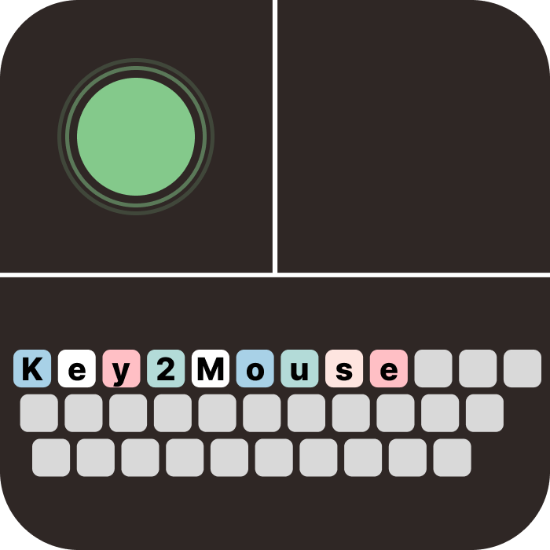

# key2mouse

## Abstract

- キーボード操作でマウスカーソル移動、クリック、スクロールが可能
- TUIで編集可能

## Install

- zipファイルをダウンロードして解凍

### Stable Release

- [Release](https://github.com/Cell1729/key2mouse/releases/tag/Stable)

## Usage

1. `key2mouse_noconsole.exe`を起動
2. `Start Controller`を選択

## TUI Usage

1. 隠しトレイから右クリックし`Open TUI`を選択
2. TUIが表示されるので下記のように設定してください。

> 現在No consoleで起動するとTUIが表示されません。
> そのためTUIを使う場合は`key2mouse`を起動してからTUIを表示してください。
